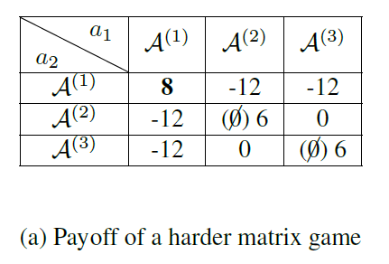

# Qfamily for Matrix Games

## 1. Motivation
There have been a lot of research works (e.g., QTRAN and QPLEX) using matrix Games to analyze the performance of their algorithms. An example is shown in the following figure.



Although the task is simple and the Game only contains a single state, available implementations usually build the code on top of a popular repository: [PyMARL](https://github.com/oxwhirl/pymarl).
However, PyMARL is a relatively heavy codebase, which is naturally designed for complex multiagent tasks (e.g., the Starcraft Multiagent Challenge). 
Using PyMARL to test algorithms' performance on single state matrix Games is inefficient and not necessary. 
Therefore, we provide a very simple implementation of the typical value decomposition methods (e.g., QMIX, QTRAN) for solving single state Matrix Games.

## 2. Algorithms
Currently, the supported algorithms include:


| Algorithm | Progress |
| :------- | :-------------- | 
| VDN | :white_check_mark: |
| QMIX | :white_check_mark: |
| QTRAN | :white_check_mark: |
| QPLEX | :white_check_mark: |

If you want to have a quick review of these algorithms, you could refer to [基于值分解的多智能体强化算法回顾 - 郝晓田的文章 - 知乎](
https://zhuanlan.zhihu.com/p/421909836). The examples shown in this blog are based on this repository.
For more details, please refer to the original papers.

## 3. How to use?
Just read and modify `q_factorization.py` and run your code.

```python
algorithms = ["vdn", "weighted_vdn", "qmix", "qtran_vdn", "qtran_qmix", "qplex"]
# %%%%%%%%%%%% Step1: choose algorithm %%%%%%%%%%%%
algo = algorithms[4]
print("Use {}".format(algo))

# %%%%%%%%%%%% Step2: choose matrix (for convenience of representation, we flatten the matrix into a vector) %%%%%%%%%%%%
payoff_flatten_vector = [8, -12, -12,
                         -12, 6, 0,
                         -12, 0, 6]

# %%%%%%%%%%%% Step3: choose other parameters, note that: action_num**agent_num = |payoff-matrix| %%%%%%%%%%%%
seed = 1

random.seed(seed)
np.random.seed(seed)
th.manual_seed(seed)
train(algo=algo, agent_num=2, action_num=3, hidden_dim=16, epoch=5000)

```
Example running results:
```text
Use qtran_qmix
******************* [q_i] init q tables *******************
-------------- agent-0: greedy action=2 --------------
[-0.287048876285553, -0.3080269992351532, 0.02482736110687256]
--------------------------------------

-------------- agent-1: greedy action=1 --------------
[-0.0695684552192688, 0.23977404832839966, -0.23643115162849426]
--------------------------------------

Iter=0: MSE loss=20.30973243713379
Iter=100: MSE loss=0.0004906946560367942
Iter=200: MSE loss=1.7209913494298235e-09
Iter=300: MSE loss=4.0421987046630747e-13
Iter=400: MSE loss=1.0105496761657687e-13
Iter=500: MSE loss=2.5263741904144217e-14
Iter=600: MSE loss=2.5263741904144217e-14
Iter=700: MSE loss=2.5263741904144217e-14
Iter=800: MSE loss=2.5263741904144217e-14
Iter=900: MSE loss=2.5263741904144217e-14
Iter=1000: MSE loss=1.0105496761657687e-13
Iter=1100: MSE loss=1.0105496761657687e-13
Iter=1200: MSE loss=1.0105496761657687e-13
Iter=1300: MSE loss=2.5263741904144217e-14
Iter=1400: MSE loss=2.5263741904144217e-14
Iter=1500: MSE loss=1.0105496761657687e-13
Iter=1600: MSE loss=2.5263741904144217e-14
Iter=1700: MSE loss=2.5263741904144217e-14
Iter=1800: MSE loss=1.0105496761657687e-13
Iter=1900: MSE loss=2.5263741904144217e-14
Iter=2000: MSE loss=1.0105496761657687e-13
Iter=2100: MSE loss=2.5263741904144217e-14
Iter=2200: MSE loss=2.5263741904144217e-14
Iter=2300: MSE loss=1.0105496761657687e-13
Iter=2400: MSE loss=2.5263741904144217e-14
Iter=2500: MSE loss=2.5263741904144217e-14
Iter=2600: MSE loss=1.0105496761657687e-13
Iter=2700: MSE loss=2.5263741904144217e-14
Iter=2800: MSE loss=2.5263741904144217e-14
Iter=2900: MSE loss=1.0105496761657687e-13
Iter=3000: MSE loss=2.5263741904144217e-14
Iter=3100: MSE loss=2.5263741904144217e-14
Iter=3200: MSE loss=1.0105496761657687e-13
Iter=3300: MSE loss=2.5263741904144217e-14
Iter=3400: MSE loss=2.5263741904144217e-14
Iter=3500: MSE loss=1.0105496761657687e-13
Iter=3600: MSE loss=2.5263741904144217e-14
Iter=3700: MSE loss=1.0105496761657687e-13
Iter=3800: MSE loss=2.5263741904144217e-14
Iter=3900: MSE loss=1.0105496761657687e-13
Iter=4000: MSE loss=1.0105496761657687e-13
Iter=4100: MSE loss=1.0105496761657687e-13
Iter=4200: MSE loss=1.0105496761657687e-13
Iter=4300: MSE loss=1.0105496761657687e-13
Iter=4400: MSE loss=1.0105496761657687e-13
Iter=4500: MSE loss=1.0105496761657687e-13
Iter=4600: MSE loss=1.0105496761657687e-13
Iter=4700: MSE loss=2.5263741904144217e-14
Iter=4800: MSE loss=1.0105496761657687e-13
Iter=4900: MSE loss=2.5263741904144217e-14
******************* [q_i] Learned individual q tables *******************
-------------- agent-0: greedy action=0 --------------
[0.02803121507167816, -0.03033892810344696, -0.129923477768898]
--------------------------------------

-------------- agent-1: greedy action=0 --------------
[0.17259716987609863, 0.06850186735391617, 0.08526611328125]
--------------------------------------

******************* Predicted Q_tot: *******************
[[7.999999523162842], [7.3026652336120605], [7.410115718841553]]
[[7.593324184417725], [6.90786600112915], [7.013596534729004]]
[[6.919672012329102], [6.253993511199951], [6.356848239898682]]
******************* True Q_joint: *******************
[[8.0], [-12.0], [-12.0]]
[[-12.0], [6.0], [0.0]]
[[-12.0], [0.0], [6.0]]

Process finished with exit code 0


```

## Citation
```text
@software{qfamily_for_MatrixGame,
  title = {A Very Simple Implementation of the Typical Value Decomposition Methods for Solving Single State Matrix Games},
  author = {Xiaotian Hao, Zipeng Dai},
  url = {https://github.com/tjuHaoXiaotian/Qfamily_for_MatrixGame},
  version = {1.0},
  month = {12},
  year = {2020}
}
```
